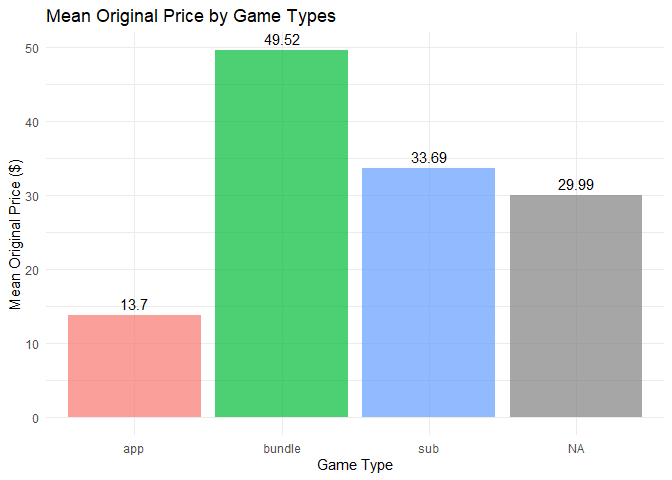
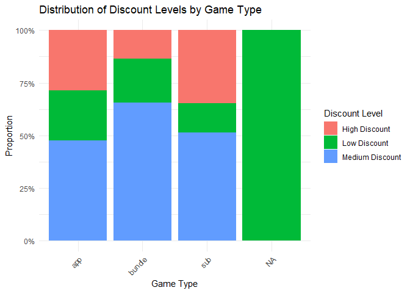
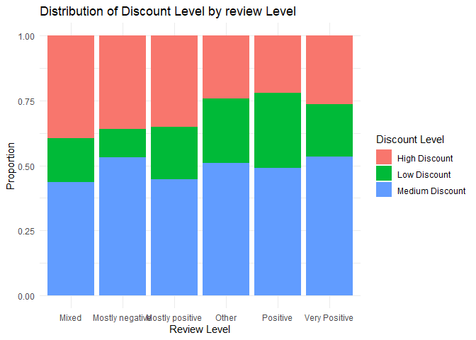
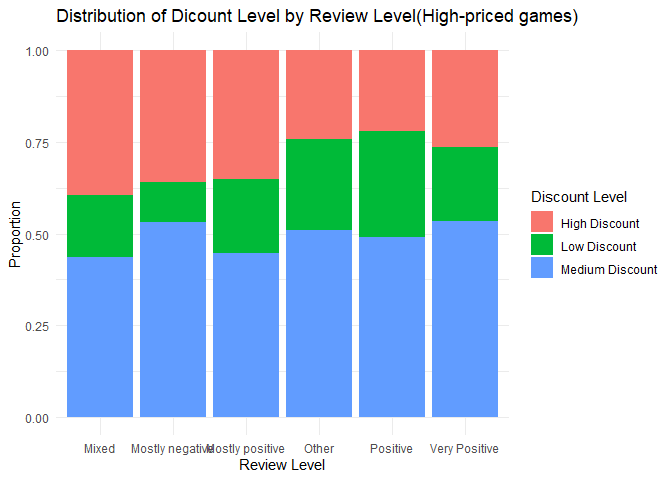

*To complete this milestone, you can edit [this `.rmd`
file](https://github.com/UBC-STAT/STAT545.github.io/blob/main/content/mini-data-analysis/mini-project-2.Rmd)
directly. Fill in the sections that are commented out with
`<!--- start your work here--->`. When you are done, make sure to knit
to an `.md` file by changing the output in the YAML header to
`github_document`, before submitting a tagged release on canvas.*

# Welcome to the rest of your mini data analysis project!

In Milestone 1, you explored your data. and came up with research
questions. This time, we will finish up our mini data analysis and
obtain results for your data by:

- Making summary tables and graphs
- Manipulating special data types in R: factors and/or dates and times.
- Fitting a model object to your data, and extract a result.
- Reading and writing data as separate files.

We will also explore more in depth the concept of *tidy data.*

**NOTE**: The main purpose of the mini data analysis is to integrate
what you learn in class in an analysis. Although each milestone provides
a framework for you to conduct your analysis, it’s possible that you
might find the instructions too rigid for your data set. If this is the
case, you may deviate from the instructions – just make sure you’re
demonstrating a wide range of tools and techniques taught in this class,
and indicate *why* you had to deviate. Feel free to contact the
instructor in these cases.

# Instructions

**To complete this milestone**, edit [this very `.Rmd`
file](https://github.com/UBC-STAT/STAT545.github.io/blob/main/content/mini-data-analysis/mini-project-2.Rmd)
directly. Fill in the sections that are tagged with
`<!--- start your work here--->`.

**To submit this milestone**, make sure to knit this `.Rmd` file to an
`.md` file by changing the YAML output settings from
`output: html_document` to `output: github_document`. Commit and push
all of your work to your mini-analysis GitHub repository, and tag a
release on GitHub. Then, submit a link to your tagged release on canvas.

**Points**: This milestone is worth 50 points: 45 for your analysis, and
5 for overall reproducibility, cleanliness, and coherence of the Github
submission.

**Research Questions**: In Milestone 1, you chose four research
questions to focus on. Wherever realistic, your work in this milestone
should relate to these research questions whenever we ask for
justification behind your work. In the case that some tasks in this
milestone don’t align well with one of your research questions, feel
free to discuss your results in the context of a different research
question.

# Learning Objectives

By the end of this milestone, you should:

- Understand what *tidy* data is, and how to create it using `tidyr`.
- Generate a reproducible and clear report using R Markdown.
- Manipulating special data types in R: factors and/or dates and times.
- Fitting a model object to your data, and extract a result.
- Reading and writing data as separate files.

# Setup

Begin by loading your data and the tidyverse package below:

``` r
library(datateachr) # <- might contain the data you picked!
library(tidyverse)
```

# Task 1: Process and summarize your data

From Milestone 1, you should have an idea of the basic structure of your
dataset (e.g. number of rows and columns, class types, etc.). Here, we
will start investigating your data more in-depth using various data
manipulation functions.

### 1.1 (1 point)

First, write out the 4 research questions you defined in milestone 1
were. This will guide your work through milestone 2:

<!-------------------------- Start your work below ---------------------------->

1.  What factors determine a game’s price?

My hypothesis: Game type, the year of release, or achievements would
influence the price.

2.  What factors affect the discount strategy of games?

My hypothesis: Games with better reviews tend to have lower discount
rate.

3.  What is the relationship between discount rate and review score?

4.  Are high-priced games with large discounts more likely to receive
    positive reviews?
    <!----------------------------------------------------------------------------->

Here, we will investigate your data using various data manipulation and
graphing functions.

### 1.2 (8 points)

Now, for each of your four research questions, choose one task from
options 1-4 (summarizing), and one other task from 4-8 (graphing). You
should have 2 tasks done for each research question (8 total). Make sure
it makes sense to do them! (e.g. don’t use a numerical variables for a
task that needs a categorical variable.). Comment on why each task helps
(or doesn’t!) answer the corresponding research question.

Ensure that the output of each operation is printed!

Also make sure that you’re using dplyr and ggplot2 rather than base R.
Outside of this project, you may find that you prefer using base R
functions for certain tasks, and that’s just fine! But part of this
project is for you to practice the tools we learned in class, which is
dplyr and ggplot2.

**Summarizing:**

1.  Compute the *range*, *mean*, and *two other summary statistics* of
    **one numerical variable** across the groups of **one categorical
    variable** from your data.
2.  Compute the number of observations for at least one of your
    categorical variables. Do not use the function `table()`!
3.  Create a categorical variable with 3 or more groups from an existing
    numerical variable. You can use this new variable in the other
    tasks! *An example: age in years into “child, teen, adult, senior”.*
4.  Compute the proportion and counts in each category of one
    categorical variable across the groups of another categorical
    variable from your data. Do not use the function `table()`!

**Graphing:**

6.  Create a graph of your choosing, make one of the axes logarithmic,
    and format the axes labels so that they are “pretty” or easier to
    read.
7.  Make a graph where it makes sense to customize the alpha
    transparency.

Using variables and/or tables you made in one of the “Summarizing”
tasks:

8.  Create a graph that has at least two geom layers.
9.  Create 3 histograms, with each histogram having different sized
    bins. Pick the “best” one and explain why it is the best.

Make sure it’s clear what research question you are doing each operation
for!

<!------------------------- Start your work below ----------------------------->

``` r
#lirary the package needed
library(ggplot2)
library(dplyr)
#In milestone 1, I notice there are two entries with extremely high original price. I think there might be some error about these two, so I decide to exclude them from my analysis.

steam_games_filtered <- steam_games %>%  #create a new dataset
  arrange(desc(original_price)) %>%   #arrange the entries in descending order.
  slice(-(1:2))  #exclude the two entries with extremely high original price
```

1.  What factors determine a game’s price? For this question. I want to
    see the relationship between game type and original price, so I
    would choose “1.Compute the *range*, *mean*, and *two other summary
    statistics* of **one numerical variable** across the groups of **one
    categorical variable** from your data.”

``` r
steam_games_filtered %>%
  group_by(types) %>%
  summarise(
    mean_price = mean(original_price, na.rm = TRUE),
    max_price = max(original_price, na.rm = TRUE),
    min_price = min(original_price, na.rm = TRUE),
    median_price = median(original_price, na.rm = TRUE),
    sd_price = sd(original_price, na.rm = TRUE)
  )
```

    ## # A tibble: 4 × 6
    ##   types  mean_price max_price min_price median_price sd_price
    ##   <chr>       <dbl>     <dbl>     <dbl>        <dbl>    <dbl>
    ## 1 app          13.7     995        0            4.99     47.0
    ## 2 bundle       49.5     529.       1.98        22.5      77.5
    ## 3 sub          33.7     999        2.99        20.0      80.7
    ## 4 <NA>         30.0      30.0     30.0         30.0      NA

Then I want to draw a histogram to compare the mean original prices of
these three types, so I choose 8. Create a graph that has at least two
geom layers.

``` r
mean_price <- steam_games_filtered %>%
  group_by(types) %>%
  summarise(mean_price = mean(original_price, na.rm = TRUE))
            
ggplot(mean_price, aes(x = types, y = mean_price, fill = types)) +
  geom_col(alpha = 0.7) +  # Layer 1: bars
  geom_text(aes(label = round(mean_price, 2)),  # Layer 2: labels
            vjust = -0.5, size = 4) +
  labs(title = "Mean Original Price by Game Types",
       x = "Game Type",
       y = "Mean Original Price ($)") +
  theme_minimal() +
  theme(legend.position = "none")
```

<!-- -->

2.  What factors affect the discount strategy of games?

Because the original prices of every game are different, I think it
would be much clear if I calculate the discount rate rather than
directly compare the discount price. And I will then create a new
variable based on the discount rate, so I will choose 3. Create a
categorical variable with 3 or more groups from an existing numerical
variable.

``` r
steam_games_filtered <- steam_games_filtered %>%
# Exclude rows with missing data, free games, and cases where the discount price is higher than the original price.
  filter(
    !is.na(original_price),
    !is.na(discount_price),
    original_price > 0,
    discount_price <= original_price
  ) %>%
  mutate(
    discount_percent = ((original_price - discount_price) / original_price) * 100,
    discount_level = case_when(
      discount_percent < 30 ~ "Low Discount",
      discount_percent < 70 ~ "Medium Discount",
      TRUE ~ "High Discount"
    )
  )
```

Then I want to draw a histogram to see the proportion and counts of each
discount level in the three game types, so I choose 8. Create a graph
that has at least two geom layers.

``` r
ggplot(steam_games_filtered, aes(x = types, fill = discount_level)) +
  geom_bar(position = "fill") +  
  labs(title = "Distribution of Discount Levels by Game Type",
       x = "Game Type",
       y = "Proportion",
       fill = "Discount Level") +
  scale_y_continuous(labels = scales::percent) +
  theme_minimal() +
  theme(axis.text.x = element_text(angle = 45, hjust = 1))
```

<!-- -->

3.  What is the relationship between discount rate and review score?

I would like to check the proportion and counts of each discount level
in each review score, so I will choose 4. Compute the proportion and
counts in each category of one categorical variable across the groups of
another categorical variable from your data.

I will first categorize all_review into 3 levels: mixed,mostly negative,
mostly positive, positive and very positive.

``` r
steam_games_filtered <- steam_games_filtered %>%
  mutate(
    review_level = case_when(
      grepl("^Very Positive", all_reviews, ignore.case = TRUE) ~ "Very Positive",
      grepl("^Positive", all_reviews, ignore.case = TRUE)      ~ "Positive",
      grepl("^Mostly positive", all_reviews, ignore.case = TRUE)         ~ "Mostly positive",
      grepl("^Mostly negative", all_reviews, ignore.case = TRUE)         ~ "Mostly negative",
      grepl("^Mixed", all_reviews, ignore.case = TRUE)         ~ "Mixed",
      TRUE                                                      ~ "Other"    )
  )
```

Then I will explore the relationship between review levels and discount
levels.

``` r
library(dplyr)

discount_review_summary <- steam_games_filtered %>%
  group_by(review_level, discount_level) %>%
  summarise(count = n(), .groups = "drop") %>% 
  group_by(review_level) %>%                  
  mutate(proportion = count / sum(count))    

discount_review_summary
```

    ## # A tibble: 18 × 4
    ## # Groups:   review_level [6]
    ##    review_level    discount_level  count proportion
    ##    <chr>           <chr>           <int>      <dbl>
    ##  1 Mixed           High Discount     163      0.396
    ##  2 Mixed           Low Discount       69      0.167
    ##  3 Mixed           Medium Discount   180      0.437
    ##  4 Mostly negative High Discount      33      0.359
    ##  5 Mostly negative Low Discount       10      0.109
    ##  6 Mostly negative Medium Discount    49      0.533
    ##  7 Mostly positive High Discount     103      0.352
    ##  8 Mostly positive Low Discount       59      0.201
    ##  9 Mostly positive Medium Discount   131      0.447
    ## 10 Other           High Discount     422      0.243
    ## 11 Other           Low Discount      431      0.248
    ## 12 Other           Medium Discount   883      0.509
    ## 13 Positive        High Discount      59      0.221
    ## 14 Positive        Low Discount       77      0.288
    ## 15 Positive        Medium Discount   131      0.491
    ## 16 Very Positive   High Discount      88      0.263
    ## 17 Very Positive   Low Discount       68      0.204
    ## 18 Very Positive   Medium Discount   178      0.533

I would like to visualize my findings with histogram, so I would choose
8. Create a graph that has at least two geom layers.

``` r
library(ggplot2)

ggplot(discount_review_summary, aes(x = review_level, y = proportion, fill = discount_level)) +
  geom_col(position = "fill") +  
  labs(title = "Distribution of Discount Level by review Level",
       x = "Review Level",
       y = "Proportion",
       fill = "Discount Level") +
  theme_minimal()
```

<!-- -->

4.  Are high-priced games with large discounts more likely to receive
    positive reviews?

To analyze this question, I would like to first define what high-priced
games are. I would like to rearrange the original prices in descending
order, and categorize the first quatile as high-priced games, so I would
choose 3. Create a categorical variable with 3 or more groups from an
existing numerical variable.

``` r
steam_games_filtered <- steam_games_filtered %>%
  mutate(
    high_price = ifelse(original_price >= quantile(original_price, 0.75), "High Price", "Other")
  )
```

Then I would like to paint a histogram to see the distribution of review
levels in each discount levels among high-priced games, so I would
choose 8. Create a graph that has at least two geom layers.

``` r
high_price_review <- steam_games_filtered %>%
  filter(high_price == "High Price") %>%
  group_by(discount_level, review_level) %>%
  summarise(count = n(), .groups = "drop")

ggplot(discount_review_summary, aes(x = review_level, y = proportion, fill = discount_level)) + 
  geom_col(position = "fill") + 
  labs(title = "Distribution of Dicount Level by Review Level(High-priced games)", x = "Review Level", y = "Proportion", fill = "Discount Level") + 
  theme_minimal()
```

<!-- -->

<!----------------------------------------------------------------------------->

### 1.3 (2 points)

Based on the operations that you’ve completed, how much closer are you
to answering your research questions? Think about what aspects of your
research questions remain unclear. Can your research questions be
refined, now that you’ve investigated your data a bit more? Which
research questions are yielding interesting results?

<!------------------------- Write your answer here ---------------------------->

My research questions focus on what factors would influence the original
price and discount strategy of games, but I only explore the
relationship between game types and review levels with game prices. I
suppose there would be other undetected factors, too. For example, I
think the game prices might also have something to do with release date.
Older games might be less expensive than new ones.

For question 1 and 2, I found that game bundles tend to have higher
original prices and lower discount rate. For question 3 and 4, I found
that regardless original prices, games with more positive reviews are
less likely to have high discount rate.

<!----------------------------------------------------------------------------->

# Task 2: Tidy your data

In this task, we will do several exercises to reshape our data. The goal
here is to understand how to do this reshaping with the `tidyr` package.

A reminder of the definition of *tidy* data:

- Each row is an **observation**
- Each column is a **variable**
- Each cell is a **value**

### 2.1 (2 points)

Based on the definition above, can you identify if your data is tidy or
untidy? Go through all your columns, or if you have \>8 variables, just
pick 8, and explain whether the data is untidy or tidy.

<!--------------------------- Start your work below --------------------------->

``` r
library(tidyr)
steam_games_tidy <- steam_games_filtered %>%
  select(name, types, original_price, discount_price, discount_percent,
         discount_level, review_level, high_price)

print(steam_games_tidy)
```

    ## # A tibble: 3,134 × 8
    ##    name      types original_price discount_price discount_percent discount_level
    ##    <chr>     <chr>          <dbl>          <dbl>            <dbl> <chr>         
    ##  1 Crankies… app             625.           10.5             98.3 High Discount 
    ##  2 Crankies… app             625.           10.5             98.3 High Discount 
    ##  3 Fitzzle … app             625.           56.3             91.0 High Discount 
    ##  4 Digit Da… app             625.           56.3             91.0 High Discount 
    ##  5 Fitzzle … app             625.           56.3             91.0 High Discount 
    ##  6 Little R… app             625.           10.5             98.3 High Discount 
    ##  7 Kicking … app             625.           56.3             91.0 High Discount 
    ##  8 Fitzzle … app             625.           56.3             91.0 High Discount 
    ##  9 QLORB 2   app             625.           10.5             98.3 High Discount 
    ## 10 Depth Si… app             625.           10.5             98.3 High Discount 
    ## # ℹ 3,124 more rows
    ## # ℹ 2 more variables: review_level <chr>, high_price <chr>

I examined 8 variables from my dataset: name, type, original_price,
discount_price, discount_percent, discount_level, review_level, and
high_price. Overall, the dataset is tidy, as each row represents one
game (an observation) and each column represents a single variable.

<!----------------------------------------------------------------------------->

### 2.2 (4 points)

Now, if your data is tidy, untidy it! Then, tidy it back to it’s
original state.

If your data is untidy, then tidy it! Then, untidy it back to it’s
original state.

Be sure to explain your reasoning for this task. Show us the “before”
and “after”.

<!--------------------------- Start your work below --------------------------->

To untidy my data, I would like to merge the two price columns (oringal
price and discount price) into one price column containing two
variables. I would also merge discount percent and discount level into
one discount columns containing two variables.

``` r
steam_games_untidy <- steam_games_tidy %>%
  mutate(
    price_bundle = paste0("orig=", original_price, ";disc=", discount_price),
    discount_bundle = paste0("pct=", round(discount_percent, 2), ";lvl=", discount_level)
  ) %>%
  select(name, types, price_bundle, discount_bundle, review_level, high_price)
print(steam_games_untidy)
```

    ## # A tibble: 3,134 × 6
    ##    name               types price_bundle discount_bundle review_level high_price
    ##    <chr>              <chr> <chr>        <chr>           <chr>        <chr>     
    ##  1 Crankies Workshop… app   orig=624.74… pct=98.32;lvl=… Mixed        High Price
    ##  2 Crankies Workshop… app   orig=624.74… pct=98.32;lvl=… Mixed        High Price
    ##  3 Fitzzle Wise Owls  app   orig=624.74… pct=90.99;lvl=… Other        High Price
    ##  4 Digit Daze         app   orig=624.74… pct=90.99;lvl=… Positive     High Price
    ##  5 Fitzzle Majestic … app   orig=624.74… pct=90.99;lvl=… Other        High Price
    ##  6 Little Reds Fores… app   orig=624.74… pct=98.32;lvl=… Other        High Price
    ##  7 Kicking Kittens: … app   orig=624.74… pct=90.99;lvl=… Mostly posi… High Price
    ##  8 Fitzzle Mighty Be… app   orig=624.74… pct=90.99;lvl=… Mostly posi… High Price
    ##  9 QLORB 2            app   orig=624.74… pct=98.32;lvl=… Mostly posi… High Price
    ## 10 Depth Siege Atlan… app   orig=624.74… pct=98.32;lvl=… Mixed        High Price
    ## # ℹ 3,124 more rows

Now, I’m going to tidy it back to original state, making sure each
column only contains one variable, and each cell only contains one
value.

``` r
steam_games_retiddy <- steam_games_untidy %>%
  separate(price_bundle, into = c("orig_part", "disc_part"), sep = ";", remove = TRUE) %>%
  separate(discount_bundle, into = c("pct_part", "lvl_part"), sep = ";", remove = TRUE) %>%
  mutate(
    original_price   = as.numeric(str_replace(orig_part, "orig=", "")),
    discount_price   = as.numeric(str_replace(disc_part, "disc=", "")),
    discount_percent = as.numeric(str_replace(pct_part, "pct=", "")),
    discount_level   = str_replace(lvl_part, "lvl=", "")
  ) %>%
  select(name, types, original_price, discount_price,
         discount_percent, discount_level, review_level, high_price)

print(steam_games_retiddy)
```

    ## # A tibble: 3,134 × 8
    ##    name      types original_price discount_price discount_percent discount_level
    ##    <chr>     <chr>          <dbl>          <dbl>            <dbl> <chr>         
    ##  1 Crankies… app             625.           10.5             98.3 High Discount 
    ##  2 Crankies… app             625.           10.5             98.3 High Discount 
    ##  3 Fitzzle … app             625.           56.3             91.0 High Discount 
    ##  4 Digit Da… app             625.           56.3             91.0 High Discount 
    ##  5 Fitzzle … app             625.           56.3             91.0 High Discount 
    ##  6 Little R… app             625.           10.5             98.3 High Discount 
    ##  7 Kicking … app             625.           56.3             91.0 High Discount 
    ##  8 Fitzzle … app             625.           56.3             91.0 High Discount 
    ##  9 QLORB 2   app             625.           10.5             98.3 High Discount 
    ## 10 Depth Si… app             625.           10.5             98.3 High Discount 
    ## # ℹ 3,124 more rows
    ## # ℹ 2 more variables: review_level <chr>, high_price <chr>

<!----------------------------------------------------------------------------->

### 2.3 (4 points)

Now, you should be more familiar with your data, and also have made
progress in answering your research questions. Based on your interest,
and your analyses, pick 2 of the 4 research questions to continue your
analysis in the remaining tasks:

<!-------------------------- Start your work below ---------------------------->

1.  What factors determine a game’s price?
2.  What factors affect the discount strategy of games?

<!----------------------------------------------------------------------------->

Explain your decision for choosing the above two research questions.

<!--------------------------- Start your work below --------------------------->

I would choose the above two research questions because in previous
tasks, I only explore the relationship between game types and review
levels with game prices and discount rate. I think there would be other
undetect factors. I’m also interested in the relationship between
release dates and game prices.

<!----------------------------------------------------------------------------->

Now, try to choose a version of your data that you think will be
appropriate to answer these 2 questions. Use between 4 and 8 functions
that we’ve covered so far (i.e. by filtering, cleaning, tidy’ing,
dropping irrelevant columns, etc.).

(If it makes more sense, then you can make/pick two versions of your
data, one for each research question.)

<!--------------------------- Start your work below --------------------------->

I would choose the tidy version of data to continue my analysis because
my analysis focuses on the pricing and discounting of games, which
involves numeric variables. It would be easier for me to visualize the
data if one column only contains one value.

# Task 3: Modelling

## 3.0 (no points)

Pick a research question from 1.2, and pick a variable of interest
(we’ll call it “Y”) that’s relevant to the research question. Indicate
these.

<!-------------------------- Start your work below ---------------------------->

**Research Question**: What factors determine a game’s price?

**Variable of interest**: original price

I’m interested the relationship between original price and release date
of the games. My hypothesis is that older games tend to have lower
orginal prices than the new ones.

<!----------------------------------------------------------------------------->

## 3.1 (3 points)

Fit a model or run a hypothesis test that provides insight on this
variable with respect to the research question. Store the model object
as a variable, and print its output to screen. We’ll omit having to
justify your choice, because we don’t expect you to know about model
specifics in STAT 545.

- **Note**: It’s OK if you don’t know how these models/tests work. Here
  are some examples of things you can do here, but the sky’s the limit.

  - You could fit a model that makes predictions on Y using another
    variable, by using the `lm()` function.
  - You could test whether the mean of Y equals 0 using `t.test()`, or
    maybe the mean across two groups are different using `t.test()`, or
    maybe the mean across multiple groups are different using `anova()`
    (you may have to pivot your data for the latter two).
  - You could use `lm()` to test for significance of regression
    coefficients.

<!-------------------------- Start your work below ---------------------------->

I would like to calculate the time difference(days) between 2025-10-01
and the release date of the games.

``` r
steam_games_filtered <- steam_games_filtered %>%
  mutate(release_date = mdy(release_date)) %>%
  mutate(days_since_release = as.numeric(Sys.Date() - release_date) )
```

    ## Warning: There was 1 warning in `mutate()`.
    ## ℹ In argument: `release_date = mdy(release_date)`.
    ## Caused by warning:
    ## !  511 failed to parse.

Then I would like to perform linear model to test the relationship
between days since released and original prices.

``` r
original_price_model <- lm(original_price ~ days_since_release, data = steam_games_filtered)

summary(original_price_model)
```

    ## 
    ## Call:
    ## lm(formula = original_price ~ days_since_release, data = steam_games_filtered)
    ## 
    ## Residuals:
    ##    Min     1Q Median     3Q    Max 
    ## -80.36 -75.04 -62.09 -15.85 544.39 
    ## 
    ## Coefficients:
    ##                     Estimate Std. Error t value Pr(>|t|)    
    ## (Intercept)        84.189368   7.753620  10.858   <2e-16 ***
    ## days_since_release -0.001221   0.002217  -0.551    0.582    
    ## ---
    ## Signif. codes:  0 '***' 0.001 '**' 0.01 '*' 0.05 '.' 0.1 ' ' 1
    ## 
    ## Residual standard error: 149.1 on 2620 degrees of freedom
    ##   (512 observations deleted due to missingness)
    ## Multiple R-squared:  0.0001157,  Adjusted R-squared:  -0.0002659 
    ## F-statistic: 0.3032 on 1 and 2620 DF,  p-value: 0.5819

<!----------------------------------------------------------------------------->

## 3.2 (3 points)

Produce something relevant from your fitted model: either predictions on
Y, or a single value like a regression coefficient or a p-value.

- Be sure to indicate in writing what you chose to produce.
- Your code should either output a tibble (in which case you should
  indicate the column that contains the thing you’re looking for), or
  the thing you’re looking for itself.
- Obtain your results using the `broom` package if possible. If your
  model is not compatible with the broom function you’re needing, then
  you can obtain your results by some other means, but first indicate
  which broom function is not compatible.

<!-------------------------- Start your work below ---------------------------->

``` r
library(broom)
model_summary <- tidy(original_price_model)
model_summary
```

    ## # A tibble: 2 × 5
    ##   term               estimate std.error statistic  p.value
    ##   <chr>                 <dbl>     <dbl>     <dbl>    <dbl>
    ## 1 (Intercept)        84.2       7.75       10.9   6.76e-27
    ## 2 days_since_release -0.00122   0.00222    -0.551 5.82e- 1

The coefficient for days_since_release is -0.0012 with a p-value of
0.58.Because p-value is higher than 0.05, no significant relationship is
found between original price and release date.

<!----------------------------------------------------------------------------->

# Task 4: Reading and writing data

Get set up for this exercise by making a folder called `output` in the
top level of your project folder / repository. You’ll be saving things
there.

## 4.1 (3 points)

Take a summary table that you made from Task 1, and write it as a csv
file in your `output` folder. Use the `here::here()` function.

- **Robustness criteria**: You should be able to move your Mini Project
  repository / project folder to some other location on your computer,
  or move this very Rmd file to another location within your project
  repository / folder, and your code should still work.
- **Reproducibility criteria**: You should be able to delete the csv
  file, and remake it simply by knitting this Rmd file.

<!-------------------------- Start your work below ---------------------------->

I would like to output the mean_price as a csv.file.

``` r
library(here)
```

    ## here() starts at C:/Users/ZhouY/Desktop/mini-data-analysis-ZhouYinuo0907

``` r
write.csv(mean_price, here("output", "mean_price.csv"), row.names = FALSE)
```

<!----------------------------------------------------------------------------->

## 4.2 (3 points)

Write your model object from Task 3 to an R binary file (an RDS), and
load it again. Be sure to save the binary file in your `output` folder.
Use the functions `saveRDS()` and `readRDS()`.

- The same robustness and reproducibility criteria as in 4.1 apply here.

<!-------------------------- Start your work below ---------------------------->

I’m going to save original_price_model as an RDS file and then load it
again.

``` r
saveRDS(original_price_model, here("output", "original_price_model.rds"))
loaded_model <- readRDS(here("output", "original_price_model.rds"))
loaded_model
```

    ## 
    ## Call:
    ## lm(formula = original_price ~ days_since_release, data = steam_games_filtered)
    ## 
    ## Coefficients:
    ##        (Intercept)  days_since_release  
    ##          84.189368           -0.001221

<!----------------------------------------------------------------------------->

# Overall Reproducibility/Cleanliness/Coherence Checklist

Here are the criteria we’re looking for.

## Coherence (0.5 points)

The document should read sensibly from top to bottom, with no major
continuity errors.

The README file should still satisfy the criteria from the last
milestone, i.e. it has been updated to match the changes to the
repository made in this milestone.

## File and folder structure (1 points)

You should have at least three folders in the top level of your
repository: one for each milestone, and one output folder. If there are
any other folders, these are explained in the main README.

Each milestone document is contained in its respective folder, and
nowhere else.

Every level-1 folder (that is, the ones stored in the top level, like
“Milestone1” and “output”) has a `README` file, explaining in a sentence
or two what is in the folder, in plain language (it’s enough to say
something like “This folder contains the source for Milestone 1”).

## Output (1 point)

All output is recent and relevant:

- All Rmd files have been `knit`ted to their output md files.
- All knitted md files are viewable without errors on Github. Examples
  of errors: Missing plots, “Sorry about that, but we can’t show files
  that are this big right now” messages, error messages from broken R
  code
- All of these output files are up-to-date – that is, they haven’t
  fallen behind after the source (Rmd) files have been updated.
- There should be no relic output files. For example, if you were
  knitting an Rmd to html, but then changed the output to be only a
  markdown file, then the html file is a relic and should be deleted.

Our recommendation: delete all output files, and re-knit each
milestone’s Rmd file, so that everything is up to date and relevant.

## Tagged release (0.5 point)

You’ve tagged a release for Milestone 2.
